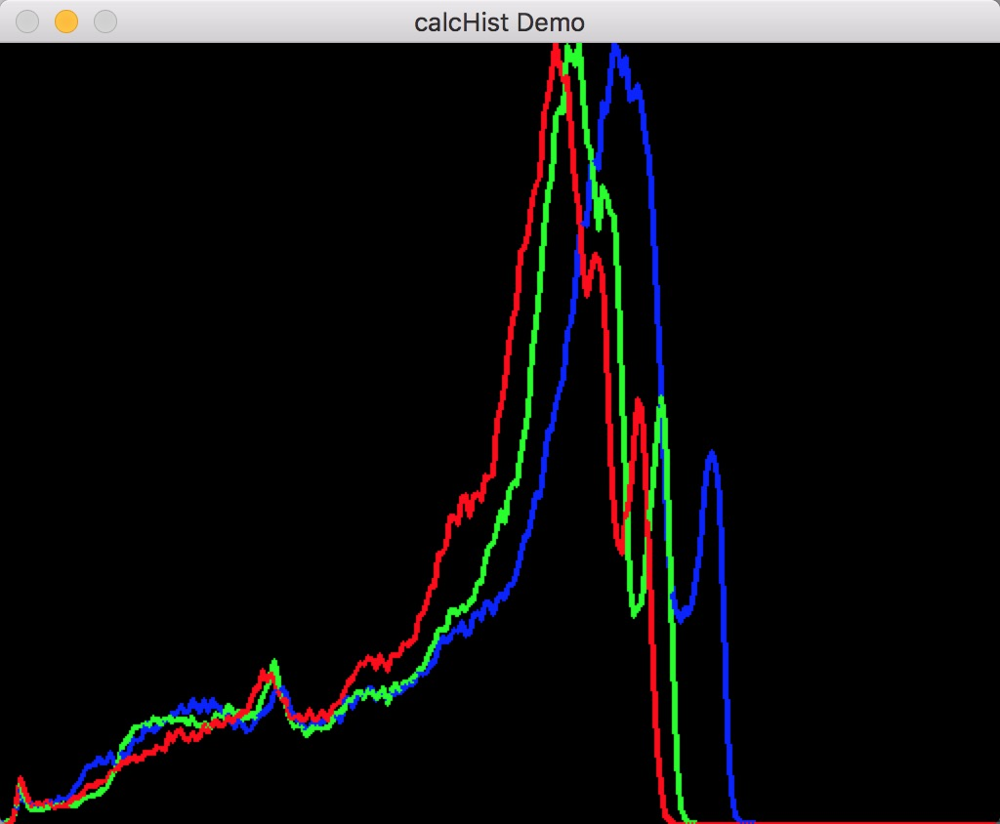
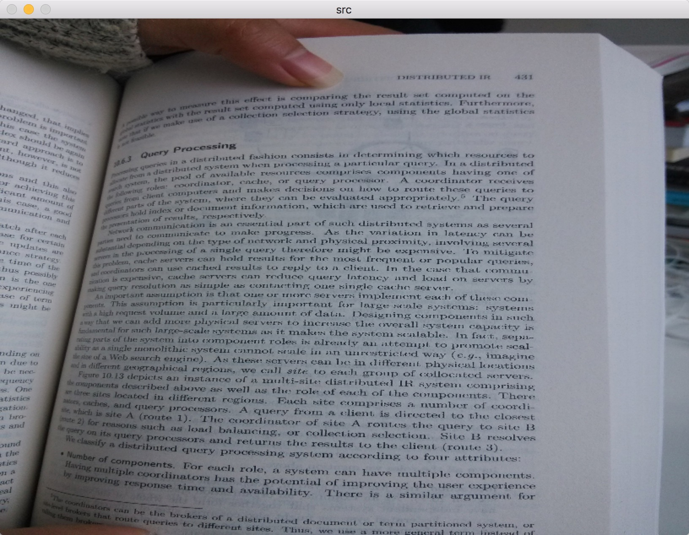
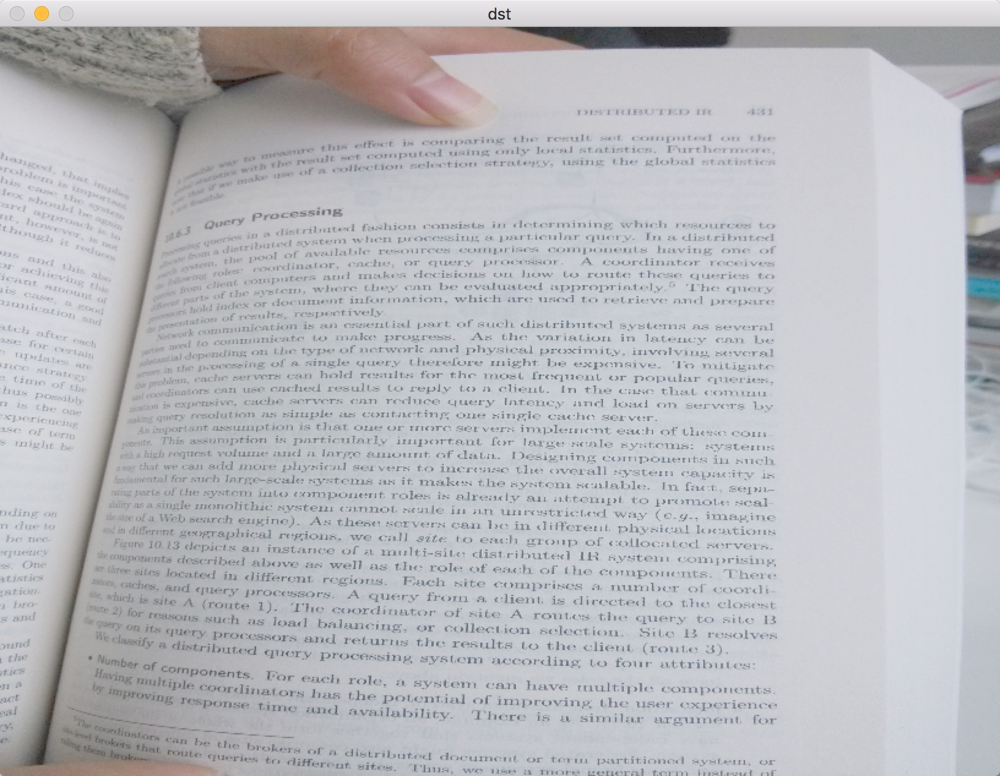

# Image Enhance By C++ & OpenCV 

----
## Overview   
**Image Enhance Method** was implemented by C++ language with the help of three party  libs, eg. [OpenCV](https://github.com/Itseez/opencv).
    
----
## Result:

* **test.jpg hist**:

* **test.jpg**:

* **dst.jpg**:

----
## License

All code in this project is provided as open source under the BSD license (2-clause "Simplified BSD License"). See LICENSE.txt. 

